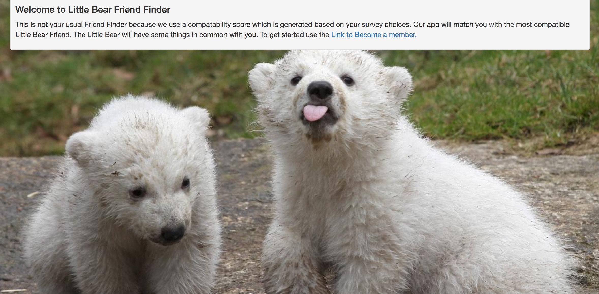
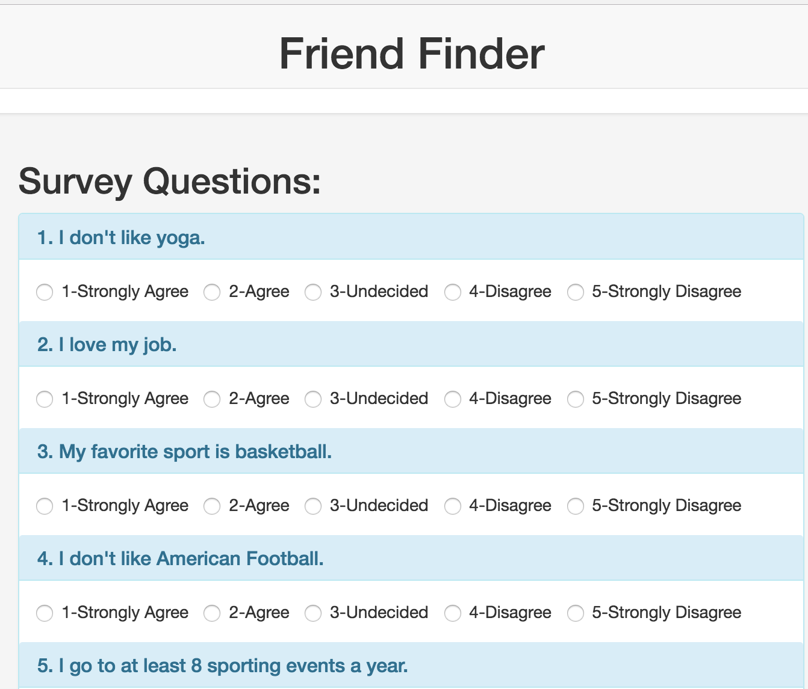
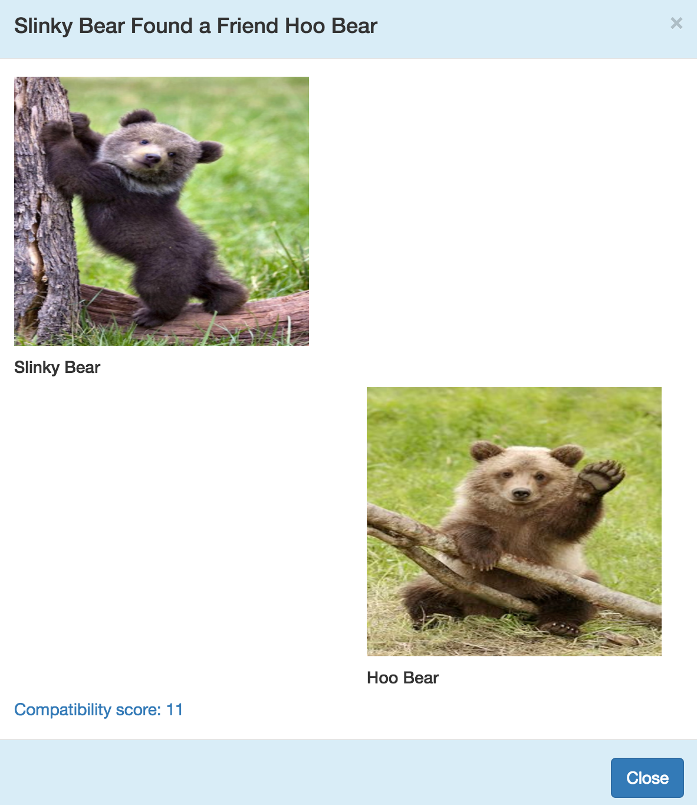
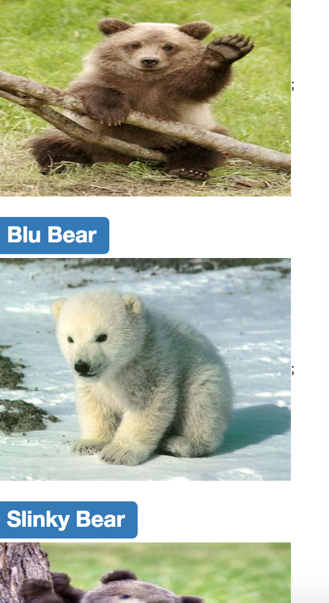
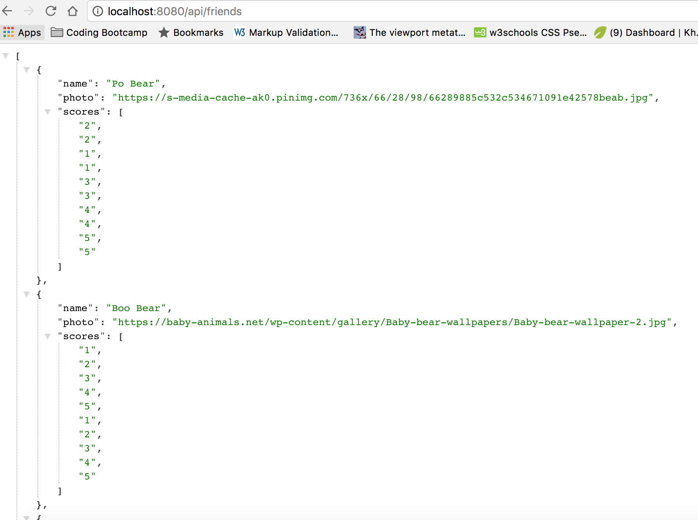

FriendFinder
# Friend Finder 
This is a Little Bear Friend Finder app. It is a compatability based Little Bear Friend Finder. 

It uses JavaScript, jQuery, npm express, node.js HTML, bootstrap, bootstrap.  
This is a full-stack site that lets you register via a survey and just name and photo info. It then uses the survey to compare differences in each answer between new Friend vs all other surveys in the JSON file. The Little Bear with the lowest number of differences between new Friend and Little Bear will be selected as the most compatible Little bear. The app will dipslay the name and picture of the new Little Bear Friend and the Little Bear in the friends JSON file. 

## What it looks like:

## Technologies Used:
- HTML 
- JavaScript
- jQuery 
- Bootstrap (also used modals feature to display a Dialog with Friend Compatability Information)
- node.js 
- JSON 
- AJAX 
- npm packages used: 
**express** used for routing and middleware functions(request-req and response-res object)  
**body-parser** used to parse the text as URL encoded data and shows the resulting object(key: value)  
on req.body. bodyParser.json(): Parses the text as JSON then shows the resulting object on req.body 
**path** used to have the ability to locate a file 

## Built With:
* Sublime Text

## Links: 	
- https://ivonnek.github.io/FriendFinder/ 
- https://github.com/IvonneK/FriendFinder/

## Author: 
**Ivonne Komis** 
Member: Rutgers Coding Bootcamp
