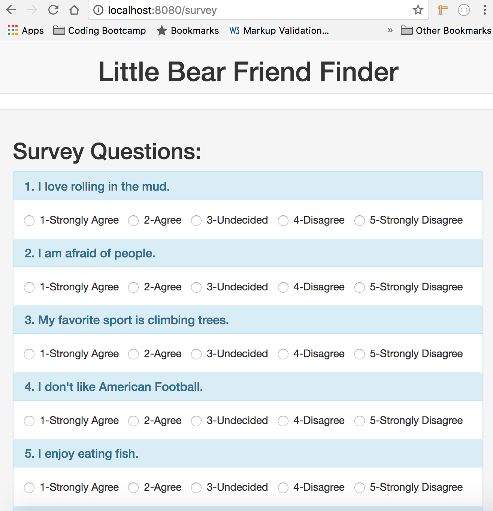

FriendFinder
# Friend Finder 
This is a Little Bear Friend Finder app. It is a compatability based Little Bear Friend Finder. 

It uses JavaScript, npm express, bootstrap, bootstrap modals for dialog box).  
This is a full-stack site that starts with a survey and then uses the user survey to compare their answers from others. The app dipslay the anme and picture of the user with the best overall match.

## What it looks like:

## Technologies Used:
- HTML 
- JavaScript
- jQuery 
- Bootstrap (used modal to display dialog box message)
- node.js 
- JSON 
- AJAX 
- npm modules used: 
**express** used to  
**body-parser** used to parse the text as URL encoded data and shows the resulting object(key: value)  
on req.body. ... bodyParser.json() : Parses the text as JSON then shows the resulting object on req.body
**path** used to have the ability to  

## Built With:
* Sublime Text

## Links: 	
- https://ivonnek.github.io/FriendFinder/ 
- https://github.com/IvonneK/FriendFinder/

## Author: 
**Ivonne Komis** 
Member: Rutgers Coding Bootcamp
